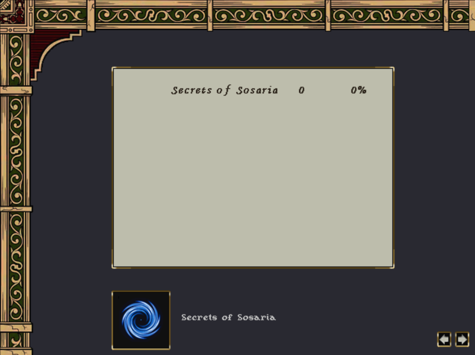
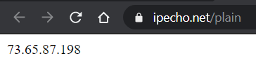

# Secrets of Sosaria Manual


## Table of Contents

- [Server Setup](#server-setup)
- [Game Setup](#game-setup)
- [Administrator Login](#administrator-login)
- [Player Login](#player-login)
- [Music Options](#music-options)
- [Server Administration](#server-administration)
- [Backups & Restores](#backups--restores)
- [Compile Source](#compile-source)
- [Multi-Player](#multi-player)
- [Updating](#updating)
- [Final Words](#final-words)

## Overview

Secrets of Sosaria is a single or multi-player adventure game that was based on
the work of the elusive maker for over a decade. The world consists of elements
of ideas, graphics, maps, and animations from various sources. The overall
scripting is based on RunUO, but heavily modified to create a new and unique
experience. Although built off the Age of Shadows era of Garriott's online game,
the mechanics have been altered to provide new ways of doing things. Some skills
that were previously useless now have a purpose. Some unused spells were brought
back to life or made to work in a single-player environment. Character class
archetypes have been enhanced, providing new ways to play and enjoy the game.
The landscape has been changed to provide players a huge area to explore.

This version is an altered version of the makers original game. It is branded as
the "Secrets of Sosaria" to pay homage to Garriott's first games. It takes place
in an alternate universe to Garriott's games, shortly after the events of his
third game called Exodus. You can create a character that tries to make their
way through many lands. You will have to find a way to feed yourself, and
acquire equipment to explore your way around. Everything you need to know can be
learned within the virtual environment. Knowledge can be acquired by talking to
the citizens of the land, or you may find a book or scroll with clues and other
information. There are also some commands you can use to bring up additional
information.

The game is designed for characters to adventure alone. You can even craft items
from your home, and have them purchased by the Merchants Guild if you choose to
make your living that way. Your default health, mana, and stamina are valued
equally to the associated attribute. So if you have a strength of 50, your
health will be 50. You can change this behavior in the settings file if you
wish. You can also obtain the title of grandmaster in 10 different skills (1,000
skill points), which should allow you to create a character archetype of your
choice (like a wizard, fighter, thief, assassin, etc.). There are other play
options that have different skill levels, benefits, and detriments as well.

This is built around older MUD methodologies and rules based on early 1970's
Dungeons & Dragons games. There is also an abundance of randomness inspired by
Rogue-like games of the 1970's. The spirit of this game is simply an experience
of exploration and discovery, with the open sandbox feel of an enormous virtual
world. The realm consists of 9 different lands, about 20 cities and villages,
and over 100 dungeons to explore. Settlements sell their own goods and may
change from time to time, but the merchants can be helpful in repairing or
identifying items. Death brings with it penalties upon resurrection, either in
the form of negative character effects or the parting of gold as tribute to the
gods that bring your life back.

Dungeons are filled with many hideous monsters, but they contain much treasure.
They can be filled with many hidden traps with varying effects. Some may harm
you with fire, lightning, or poison. Others may curse one of your items or
simply make it vanish. You could trip over a well-placed wire, breaking your
potion bottles or arrows. You could even be hit with a magical force that turns
all of your coins into lead. Traps can perhaps be avoided by those skilled in
such things, have magic that protects them from traps, or even have luck on
their side altogether. Some even carry a ten-foot pole to set off traps safely.

Like the games of yesteryear, this will have you slaying rabbits and deer as you
work your combat skills to brave further into the wilderness. The further you
can explore, and the more dangerous the area, the better the rewards. This is
about finding treasure of a monetary and magical nature to aid you in your
chosen path. It is also about resource management, as you need a supply of food
and drink if you plan to be gone for long periods of time. You will also be
faced with dilemmas on how you will carry all of your found riches from the
dungeons. Treasure is just not found in gold coins. You may find copper and
silver coins, which can fill your pouches quickly. You may find exotic furs,
rare kegs of ale, unusual carpets, strange books, or finely crafted
statues...all of which can either decorate a home or be given to people in town
in exchange for gold which can be aided if you can identify the item.

There are random quests in place that will have you traveling far and wide.
Along with that, there is also a large quest inspired by the old computer
role-playing game "The Bard's Tale". Garriott's lore has been incorporated into
the game, but morphed to fit within this potentially multiplayer environment.
You can take on quests to defeat the Shadow Lords and create a gem of
immortality. You can also defeat the Banes and bring the Serpents of Chaos and
Order back into balance. You can even work toward becoming the Titan of Ether.
There are also many characters from the original game series that may give you
quests, in which the rewards will be custom artifacts.

Player versus player mode is enabled on for the game in case you decide to play
this in a multi-player environment. This will add danger as your friend may cast
fire field to stop some monsters and you accidentally walk into it as well. You
may also decide to kill each other's characters. Along with this, there are
areas called "public areas". These are small areas that have no player versus
player mode and they are centralized to the world. So, as an example, if you go
into the bank and do your business you will go to the same bank that every other
player character goes into (no matter the town they are in). So if you play this
in a multi-player environment, you may see your friends from time to time in
these areas. When you leave the bank, you will be back in the town you entered
from. The other public areas are the Wizards Guild, the Thieves Guild, the Black
Magic Guild, the Inn, the Tavern, and a few others. Because the Secrets of
Sosaria is widely expansive, these areas simply provide a way to run into other
players.

Some dungeons have difficulty levels, and you will be notified on how difficult
a dungeon is. So a skeletal knight in an easy dungeon will be much harder within
a deadly dungeon. Treasure is scaled dependent on the dungeon difficulty. The
dungeons in Sosaria are of normal difficulty, as this is the main world most
characters begin.

There are many other different elements that you will have to discover on your
own. If you enjoyed tales of Conan or Fafhrd and the Gray Mouser. If you played
older D&D games where characters were in constant danger. If you like older
computer role-playing games and want to play something where you simply exist in
a fantasy world, then go ahead and give this a try. It was designed to play many
different types of character classes, instead of the common ones most people
play. You can be a very effective adventurer being a necromancer, alchemist,
bard, thief, or assassin. You will get the most out of this game if you try
different professions and see how you can navigate the dangers with them. There
are a ton of things to do so you just need to pick a path and go as the only
goal of the game is what you set for yourself.

## Server Setup

Secrets of Sosaria was created using RunUO emulation technology, and thus needs
a server to play whether single or multi-player. This requires a Windows
operating system with the .NET Framework installed. To begin setting up the
server, download the server package. The server is in a folder labeled `World`.
Extract the folder using a zip program and place it wherever you want. Once that
is done, you should have a `World` folder on your hard drive with the contents
shown in Figure A. For advanced features, see
[Server Administration](#server-administration).

**Figure A - World folder contents:**


You must first review and edit your game settings. This is located in the
`Settings.cs` file, which is in the `Info\Scripts` directory. Then you can run
the `World.exe` application and wait for the game server to start. If everything
is successful, you will have a console window similar to Figure B. If you are
running this for the first time, your Windows Security Alert may open asking you
if you want to let the server communicate with Private or Public networks. If
you are playing this in single-player mode, press Allow Access or Cancel. If you
are going to play this in multi-player mode, I suggest checking both Private and
Public networks and then pressing Allow Access.

**Figure B - Server console window:**

```
System Initializing...
Running on .NET Framework Version 4.0.30319
Optimizing for 8 64-bit processors
Processing. Please wait...
Game: Loading...

Network:
Detecting public IP address...done
Listening: 127.0.0.1:2593

You may now play the Adventurers of Akalabeth!
```

If everything has occurred as described, you successfully setup your Secrets of
Sosaria game server. You can close the server whenever you are done playing by
clicking the top-right "X" of the console window. If enabled, you can also type
`help` <kbd>Enter</kbd> within the console window for a list of commands.

> [!WARNING] If your cursor is selecting a part of the console window (white
> square somewhere within it), your game server will freeze until you press
> <kbd>Enter</kbd> within the console window to clear the cursor.

We can now focus on the client you need to play the game, so leave your server
running for now.

## Game Setup

The client is based on TazUO and it includes a copy of the documentation for
your players to reference. This is the folder you and your players will need to
play the game. Extract the folder using 7zip and you will see a `Game` folder
within it that you can place where you want. The main folders are `Files` and
`TazUO`. The `TazUO` folder contains similar files shown here:


Once extracted locate the `settings.json` file. Open this with Notepad and pay
attention to a particular line, the IP address as shown below:

```
  "ip": "127.0.0.1",
```

Change this to your server's IP address, or leave it as shown if your server is
running on the same computer as your client. You can even put a domain name in
here if you have a public server setup. Save the file and then you can run the
`ClassicUO.exe` application.

When you launch the client, you should be presented with a login screen as seen
below. If your chosen game client has launched to this point successfully, then
we will move onto the actual login for the first time.


## Administrator Login

You need to at least login as the administrator once before you can begin
playing. To do that, enter the information shown below and press
<kbd>Enter</kbd>.

Account Name: Admin  
Password: password

If your client is truly communicating with your server, you will get another
window displaying your server as shown below. You can select the blue portal to
continue.



The next window should show you the administrator named Dungeon Master, as shown
below. Double click the name "Dungeon Master" and you should then enter the
world.


When you enter the world for the first time, you will appear on the bridge in
the City of Britain, as shown in the next image.


You should then consider changing your password. To change your password, type
the `[password` command. You can now log out of the game and prepare yourself
for adventure.

## Player Login

You never want to play the game using the Admin account, because the world just
doesn't care about the characters within that account. Logging in as a player
will expose you to the dangers and treasure of the Secrets of Sosaria. This game
will automatically create accounts for you, so all you have to do is choose your
own account name and password. Enter that information into the login window (as
described in [Administrator Login](#administrator-login)) and press
<kbd>Enter</kbd>. Then you will be presented with the screen for selecting the
server, where you can select the blue portal. Since you have no characters, you
will be asked to create one. Go ahead and make your first adventurer. When you
first enter the world, most will normally begin with the following default
items: About 100 gold, a dagger, clothing, water, food, and a light source.

> [!TIP] When you first enter the world, use the "Help" button located on your
> character's paper doll (<kbd>Alt+P</kbd> to open the paper doll).

The LIBRARY section of the HELP screen discusses the BASICS of the standard
client interface, so if you have played games like this before, you will learn
nothing new from that. This game assumes player familiarity with Garriott's
online game so how to use the interface and play the game is beyond the scope of
this manual.


After you create your adventurer, you can enter the world and begin exploring.
That is all you need to know to play the Secrets of Sosaria. You can continue
onward in this manual if you want some additional information.

> [!NOTE] You begin in a dark forest by a gypsy tent, so look around a bit and
> investigate the different starting options.

## Music Options

There are 2 different folders in the `Game\Files\music` directory. One is
classic gaming music in the `Digital` folder. There is also a folder called
`DigitalModern`, which has more modern music for the game. If you want to switch
between these two, you will need to close your client and then rename `Digital`
to `DigitalClassic` and then rename one of the other folder to `Digital`. When
you start the client again, you will have different music. To switch back, close
your client and then rename `Digital` back to what it was and then rename the
other folder to `Digital`. Then start the client again and you will have the
other music.

## Server Administration

The client included has been heavily customized so don't use any other client
files. This excludes files you get from the client developer, as you can get
those updates from them.

There are some processes that are automatically executed by the game. One of
them is a command that builds the world, and it runs whenever you change any of
the scripts and restart the server. You can run this command at any time, if you
feel you want to force the world to rebuild. This command will leave player
characters, their houses, boats, and belongings all intact. Login as the Admin
account and run this command: `[buildworld`. It will take a few moments to
complete.

The information contained from this point forward, assumes some prior knowledge
to this game's emulation. It is not meant to be a technical tutorial.

The `Saves` folder contains the current game state. NEVER delete the `Saves`
folder as this is your game with your characters, items, and world as you left
it. If you feel, for any reason, that the world needs to be straightened up you
can login as the Admin and run the `[buildworld`. This rebuilds the world
without affecting your characters or their belongings. You can, however, delete
this folder if you are doing a restore (see
[Backups & Restores](#backups--restores) ).

The `Data` folder contains files that allow the game to function properly. This
folder and contents should not be modified. Any such actions can cause issues or
create problems if updates are applied.

The `Backups` folder will be created by the game when the first backup of the
world occurs. This folder is described in the
[Backups & Restores](#backups--restores) section.

There is a folder named `Info` where custom files are stored. Within this
directory, you have the opportunity to customize some game elements to your
tastes. Unless an update specifically instructs you to update/change files
within this folder, it is specific to your game and usually never overwritten
during updates. Each section of the contents are described below:


**`News.txt`** – This file contains the information shown in the Message of the
Day (MOTD). Edit this file as you see fit.

**`Rules.txt`** – This file has your particular server rules for other players
to be aware of. The rules are displayed on a bulletin board in areas like
taverns.

**`Articles`** – This folder contains up to 10 entries you can post (read
`0.txt` first), where these entries can be as long as you need them to be and
people can read them on bulletin boards in places like taverns. This is really
only important if you run a multi-player game and want to communicate things to
your players.

**`Decorations`** - This folder contains some `.cfg` files you can add your own
decorations to. Open these files to learn how to add your own custom
decorations.

**`Scripts`** – This folder allows for any custom drag-and-drop scripts you wish
to add to your game. Drag-and-drop refers to scripts that require no script
editing within the `World/Data` folder. There are 2 scripts located in here, and
they must remain:

1. **`Merchant.cs`** – This is the script if you enable the custom merchant in
   your game. Open it with a text editor where it explains the basics of setting
   up the merchant.

2. **`Settings.cs`** – This has all of the options you can customize for your
   game. Open this file in a text editor and go through it to see what you want
   changed. The default settings are considered to be the more difficult
   settings for the game, so review each one and acknowledge you review at the
   bottom. You can then restart the server for your changes to take effect. If
   you find a setting not to your liking later on, you can always edit this file
   again.

**`Spawns`** – This folder contains 2 files that must remain here:

1. **`Merchant.map`** – If you enable the custom merchant in your game, this
   file will be used to place the merchant wagons in your world. Do not edit it
   in any way.

2. **`Spawns.map`** – This file is yours to edit and add any custom spawns you
   want. They can be items or creatures. There are brief instructions in the
   file to explain to you how to use it.

One of the design goals was to include as much information in the game as
possible, without the need to leave the game client and browse the Internet for
information. This information, however, requires exploration to acquire. Some of
this is not contained in a detailed help file to freely browse. If you want to
know about the world, you need to seek it out. Find a sage to buy some useful
books or talk to merchants. Players can learn everything within the game and
these "Articles" and "Message of the Day" options allow you to keep players
informed without the need of a website.

There is a task manager system that runs tasks every 60, 150, 200, and 250
minutes…as well as once per day. Some of these tasks also run at server start
(by default, but it can be changed in the `Settings.cs` script within
`Info/Scripts`), so when the server comes up, don't be alarmed if you cannot log
into it instantly. It is just running a few routines. These things are in place
to make a self-sufficient server that should require no administrative
intervention.

There is a help system in place for many options and information. There is also
a mechanism to save the server when a character logs out (by default, but it can
be changed in the `Settings.cs` script within `Info/Scripts`)…but this is mostly
for those that play this in a single player environment.

## Backups & Restores

Whenever the Secrets of Sosaria saves itself, it will create a backup set of
information in the `World/Backups` folder. The system keeps the 6 latest
backups. If you ever run into an unrecoverable game system disaster, you can go
into this `Backups` folder to obtain one of your prior versions. To do this,
start by deleting the `Saves` folder in the `World` directory. Then go into your
`Backups` folder and grab the particular version you want within the `Automatic`
directory. This is usually the one called "Most Recent…". Copy this directory
into the `World` folder. Then go into your `World` folder and rename the copied
folder to `Saves`. You can then start Secrets of Sosaria and the world will be
from that point in time. You do not need to only grab the most recent backup,
but instead can choose one of the other backups you captured if you want to go
back further.

## Compile Source

If you decide to modify the source code (located in the `Data/System/Source`
directory), you will have to recompile to make a new `World.exe`. If you are
using Windows, launch PowerShell and change to the `Data/System` directory. Then
you can run the following command:

```cmd
C:\Windows\Microsoft.NET\Framework64\v4.0.30319\csc /optimize /unsafe /t:exe /out:World.exe /win32icon:Source\icon.ico /d:NEWTIMERS /d:NEWPARENT /recurse:Source\*.cs
```

If you want to compile the server to run on Linux, make sure you have Mono
installed first. Also make sure you have zlib installed. Below is an example
Linux command, but it is based on the version you use:

```bash
apt install zlib1g-dev
```

The zlib package is needed for the server, to help show gumps to the client
properly. Then you can navigate to the `Data/System` folder and run this
command:

```bash
mcs -optimize+ -unsafe -t:exe -out:WorldLinux.exe -win32icon:Source/icon.ico -nowarn:219,414 -d:NEWTIMERS -d:NEWPARENT -d:MONO -recurse:Source/*.cs
```

To launch the server, simply run the executable in a shell:

```bash
mono World.exe
```

## Multi-Player

This manual cannot go into great detail about the Secrets of Sosaria in a
multi-player environment. This is mostly due to one's home network design and
router manufacturer. One would need a basic understanding of IP addresses and
firewalls to successfully setup a public server.

First of all, the server and client communicate using port `2593`. So whatever
Windows computer you have the server on, needs to allow TCP port `2593` traffic
to communicate with it. We will use the figure below to go into an example of
setting up a multi-player environment.


If your players are within your home and connected to the home's network, they
would configure their `settings.json` file to use the IP address shown in
yellow. So in this example, they would use `192.168.141.1` instead of the local
`127.0.0.1` address.

Making the Secrets of Sosaria server visible over the Internet requires more
configuration. Your home's router needs to have some traffic rules established
to allow the Internet to communicate with port `2593` of your Windows computer
hosting the server.

Any client, connecting to your server from over the Internet, would use the
address shown in red. So in this example, they would use `66.254.150.248`
instead of the local `127.0.0.1` address. If you have acquired a domain name
that points to `66.254.150.248`, players can use that in their `settings.json`
file instead. Again, those on your internal network (or in your home) would
connect to `192.168.141.1` as shown in yellow.

> [!TIP] Look on your game server's console to acquire your particular IP
> addresses being used.

If you do not get a "Detecting public IP address" message in the console, then
things get a bit more technical. The issue could be that your local network IP
address scheme is uncommon, or you cannot reach the site that reports your
public IP address. These issues can be fixed in a file located here:

`World\Data\Scripts\System\Misc\ServerList.cs`

This file explains that you can manually enter your public IP address, but if
you are concerned that this address will change often you can try some other
troubleshooting methods. The first is your local network IP address scheme.
Within the file, there are set addresses that the game looks for as being a
local network (Figure below). If your IP address scheme does not appear in this
section, then add it yourself and try launching the server again.

**Code snippet showing IP ranges:**

```csharp
private static bool IsPrivateNetwork( IPAddress ip )
{
    if ( ip.AddressFamily == AddressFamily.InterNetworkV6 )
        return false;

    if ( Utility.IPMatch( "192.168.*", ip ) )
        return true;
    else if ( Utility.IPMatch( "10.*", ip ) )
        return true;
    else if ( Utility.IPMatch( "127.0.0.1", ip ) )
        return true;
    else if ( Utility.IPMatch( "169.254.*", ip ) )
        return true;
    else if ( Utility.IPMatch( "172.16-31.*", ip ) )
        return true;
    else
        return false;
}
```

Lastly, there is a site that the game looks for to have a public IP address
returned as shown below. If you cannot reach this site and get an IP address
returned, then you need to find a similar site that you can reach. It must
return an IP address with nothing else on the web page.



To change the web address that the game looks at, you can find it by referencing
the figure below. If you cannot find such a site to return an IP address to you,
you may have to manually set the public IP address in the `ServerList.cs` file.

**URL configuration code:**

```csharp
private static IPAddress FindPublicAddress()
{
    try {
        WebRequest req = HttpWebRequest.Create( "https://ipecho.net/plain" );
        req.Timeout = 15000;
```

Below is an example of a D-Link router, and how a port forwarding rule would
look like to have someone on the Internet connect to your Secrets of Sosaria
server. Every router is unique, however, so you will either need to figure out
how your router functions in this manner or seek help from the router's user
manual.


## Updating

From time to time, I will be releasing updates to either fix the game or add new
features. When a new version is released, there are general ways to update to
that version. Here we will cover how you update the World and the Client, when
the situation arises. Any update tasks, outside of the scope described here,
will have special notes in the update information being released. Those special
situations are uncommon and vary in process, so they will not be covered here.

When the World requires an update, download the package and follow these steps:

1. Go into your `World` directory and delete the `Data` folder.
2. Extract the `World\Data` folder, from the package, into your `World`
   directory.
3. Extract these 3 files from the package's `World\Data` directory and overwrite
   yours.

   - `Guide.pdf`
   - `Manual.pdf`
   - `World.exe`

4. You can start the `World.exe`. Once the world starts, your update is
   complete.

When the Client requires an update, download the package and follow these steps:

1. Go into your `Game` directory and delete the `Files` folder.
2. Extract the `Game\Files` folder, from the package, into your `Game`
   directory.
3. Extract these 2 files from the package's `Game` directory and overwrite
   yours.

   - `Guide.pdf`
   - `Manual.pdf`

4. You can start the game and you are done updating your client.

## Final Words

It seems that the development of the original game, from which this is based,
has ceased. So has the development of the branch that continued the development.
So, we decided to branch it off again and thus rebrand it as requested by the
original designer. By doing this, we can fix any newly discovered issues and
also make improvements that may be suggested in the spirit of the original
vision. We ask if this version is branched, that you rebrand your game to
something other than "Secrets of Sosaria".
